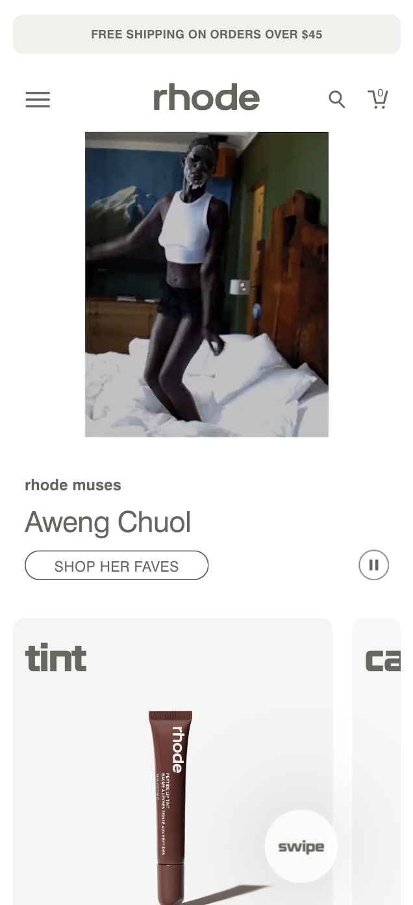
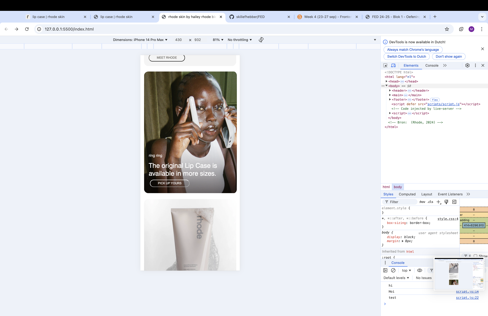

# Procesverslag
Markdown is een simpele manier om HTML te schrijven.  
Markdown cheat cheet: [Hulp bij het schrijven van Markdown](https://github.com/adam-p/markdown-here/wiki/Markdown-Cheatsheet).

Nb. De standaardstructuur en de spartaanse opmaak van de README.md zijn helemaal prima. Het gaat om de inhoud van je procesverslag. Besteedt de tijd voor pracht en praal aan je website.

Nb. Door *open* toe te voegen aan een *details* element kun je deze standaard open zetten. Fijn om dat steeds voor de relevante stuk(ken) te doen.

## Jij

  
uitwerken voor kick-off werkgroep

  ### Auteur:
  Maud Naastepad 

  #### Je startniveau:
  Blauw/rood

  #### Je focus:
  Surface plane:
   1. Light dark mode
   2. Winkelmandje vullen
   3. Na refreshen van pagina een grotere height van filmpje en dan automatisch kleiner worden
   4. Animatie met 'cleanse'
   5. Text treat tint vullen.
 

## Je website

  
uitwerken voor kick-off werkgroep

  ### Je opdracht:
  Namaken website Rhodeskin.com --> https://www.rhodeskin.com

  #### Screenshot(s) van de eerste pagina (small screen): 
  rhode skin by hailey rhode bieber
  <!-- 
   
    
     
      
        -->

  #### Screenshot(s) van de tweede pagina (small screen):
  lip case | rhode skin
  <!-- 
  
   
    
     
      
       
        
         
           -->
          
Github bestand wordt anders te groot

## Toegankelijkheidstest 1/2 (week 1)

  
uitwerken na test in 2e werkgroep

  ### Bevindingen
  Ik heb nooit eerder een screen reader gebruikt dus vond het sowieso erg zoeken met de knoppen. De reader gaf al snel aan dat ik dan op tab zou moeten klikken om elk kopje te kunnen horen. Het ging erg stroef, de tekst herhaalde zich steeds en er werd niet duidelijk verteld wat er op een afbeelding te zien was. Ook viel het tegen dat het hele lange onduidelijke zinnen waren en ik hierdoor met een beperking moeilijk begrijp wat er precies mee wordt bedoeld. Wel was de stem heel duidelijk en articuleerde goed. Ook werd er aangegeven wanneer ik bij een navigatie ben en wanneer het een button is. 

<!-- Bronnen: (Rhode, 2024) -->

## Breakdownschets (week 1)

  
uitwerken na afloop 3e werkgroep

  ### de hele pagina: 

  Pagina 1:
  
    
      

  Pagina 2:
    
    
      
       
    
      

  ### dynamisch deel (bijv menu): 
  

  ### wellicht nog een dynamisch deel (bijv filter): 
  

## Voortgang 1 (week 2)

  
uitwerken voor 1e voortgang

  ### Stand van zaken

Ik heb de website Rhode Skin van Hailey Bieber uitgekozen, omdat ik dit een mooie site vind met leuke producten. We moesten deze week beginnen met een breakdownschets, voordat we begonnen met coderen. Ik vond het handig dat we die moesten maken en alvast een idee hadden voor de echte website met html code.
Al gauw konden we beginnen met coderen en heb ik mijn html ingedeeld hoe ik het normaal ook doe. Sections, articles, etc.

Wat er nieuw was, is dat we weinig classes moeten gebruiken. Eerder gebruikte ik alleen maar classes, maar we hebben hier een goed alternatief op gekregen. Namelijk nth-of-type en nth-child. Deze vond ik erg lastig en had dit ook als vraag voor de voortgangsgesprekken bedacht.

Ook was ik begonnen aan css deze week en heb ik een scrollbar met hulp van de docent erin kunnen zetten. Hij scrollt nog niet helemaal zoals het moet, maar de tekst komt er wel in te staan. Wel staan de afbeeldingen onder de scrollbar en scrollt hij ook verticaal. Dit is dan ook mijn vraag voor het opkomende voortgangsgesprek.

  ### Agenda voor meeting
  samen met je groepje opstellen

  | Lara           | Peter              | Mamush       | Ik               |
  | ---            | ---                | ---          | ---              |
  | Articles       | ---                | H1, H2, H3   | Scrollbar en img erin |
  | canvas elementen| ---               | Articles     | Uitleg css opstelling sections |
  | ...            | ...                | ...          | ...              |

  ### Verslag van meeting
  hier na afloop snel de uitkomsten van de meeting vastleggen

  - Een goede opbouw van html is eerst section en dan article, een section is een heel blok met alle content van de verschillende articles.
  - Als je meerdere sections wil gebruiken in css, moet je nth-of-type() gebruiken. Hierdoor wordt de organisatie van je css mooi. + Goede uitleg over deze alternatieven.
  - Heel goed opletten met gebruiken van pixels! Gebruik hier bijvoorbeeld em, vw, of procenten voor.
  - Met flex-direction maak je een verticale of een horizontale rij om hier je content goed in te kunnen sorteren.
  - Leer omgaan met padding en margins en voorkom om vooraf width en heights te zetten.

## Voortgang 2 (week 3)

  
uitwerken voor 2e voortgang

  ### Stand van zaken
  Ik ben na de feedback van vorige week donderdag weer verder gegaan met de code. Ik heb veel geleerd van deze feedback en ook van de studenten erbij. Ik heb alle pixels in mijn code omgezet naar em door alles door 16 te delen. Ik liep even vast met het filmpje en de border-radius na het verzetten naar em hiervan, maar heb er met hulp van de studentassistent weer een goed beeld van kunnen maken. 

  Verder had ik problemen met de grote van de afbeeldingen in de eerste section om de img in de scrollbar te zetten.
  
  Het is nu veranderd naar de grootte van iedere afbeelding. Het probleem hierbij was wel weer dat de achtergrond kleur verwijderd moest worden en ik transform:scale() zou moeten gebruiken om de afbeeldingen op goede grootte te krijgen.

<!-- Bronnen: (MDN, transform:scale()) -->

  Ik wilde dit voordat ik transform:scale() ging gebruiken handmatig afsnijden in Photoshop en kreeg toen deze melding. 
   Door hulp van de docent is dit gelukt om met transform te doen. Thuis heb ik in mdn verder opgezocht hoe je de scale kunt gebruiken. Nu heb ik meer verstand van de grootte van een article en dat je het niet per se een achtergrond kleur aan toe moet voegen, maar ook met transform:scale() een goede overeenkomst kunt maken.

<!-- Bronnen:  (MDN, transform:scale()) -->

  ### Agenda voor meeting
  samen met je groepje opstellen

  | Julian         | Wessel             | Bibi         | Ik               |
  | ---            | ---                | ---          | ---              |
  | dit bespreken  | en dit             | en ik dit    | en dan ik dat    |
  | en dat ook nog | dit als er tijd is | nog een punt | dit wil ik zeker |
  | ...            | ...                | ...          | ...              |

  ### Verslag van meeting
  hier na afloop snel de uitkomsten van de meeting vastleggen

  - Je kunt margin-right gebruiken om de tekst op te schuiven naar onder.
  - Met scroll-snap-align:center zet je de afbeeldingen na het scrollen altijd in het midden en is het niet afgesneden.
  - Check soms even de validator voor errors. Op het einde mag je geen errors hebben.

## Toegankelijkheidstest 2/2 (week 4)

  
uitwerken na test in 9e werkgroep

  ### Bevindingen
 Mijn website is op de eerste pagina erg toegankelijk en heb ik getest met de screenreader. Als ik de website open, begint de VoiceOver automatisch met praten en gaat hij van boven naar beneden de website. Ook was het fijn dat hij opnoemde wanneer er een H2 element was en een afbeelding. Dan werd de alt genoemd die ik in de html heb vermeld. Wanneer er een carrousel was swipete hij er zelf doorheen. Het probleem hierbij was helaas wel dat de afbeeldingen niet genoemd werden en alleen de titels.

 Na de carrousel ging alles heel makkelijk en vertelde de VoiceOver ook wanneer er een knop was om op te klikken en hoe je dit moest doen.

Op de tweede pagina deed de Voiceover er hetzelfde over. Ik kwam er wel achter dat de navigatiebar eigenlijk niet duidelijk genoeg werd benoemd en dat ik hier verandering in moet maken.

Gelukkig werd er wel duidelijk aangegeven wanneer er geswiped moest worden dat de afbeeldingen horizontaal naast elkaar stonden.

Na de test ben ik wel de alt namen van de laatste carrousel gaan aanpassen, want er werden eerder niet duidelijke namen aangegeven.
Before:

After:

<!-- Bronnen: (Rhode namaak, Maud 2024), (Voiceover, 2024)-->

## Voortgang 3 (week 4)

  
uitwerken voor 3e voortgang

  ### Stand van zaken
   Ik heb weer heel veel gehad aan de feedback van vorige week donderdag. De studentassistenten hielpen me met vele goede vragen die ik nog had voor de laatste content dingen. Een daarvan was bijvoorbeeld hoe je de scrollbar in de eerste en de zesde section op het midden van ieder plaatje kon uit laten komen. Hiervoor was alleen de regel 'scroll-snap-align:center' nodig. 
  
  <!-- Bronnen: (Studentassisent uitleg) -->

   Ik heb ondertussen alle validators even gecheckt en alles was valid in html en css.
   
   Wel waren er veel info meldingen over de articles.

   Ik was erg verward met hoe je op een goede manier een svg in html moest zetten dus stelde die vraag. Ik kreeg al snel van de docent en assistenten een makkelijke uitleg. Eerst de html edit maken van de svg en dan in een mapje en html zetten. Nu moest ik alleen zelf de grootte en positie nog goed maken.
   
   Deze error kreeg ik als ik de svg net als img ging downloaden.
   
   Door de svg tip ben ik veel sneller gegaan in iconen neerzetten en dus ook een navigatiebar die ik met css compleet ga maken.
   <!-- Bronnen: (Studentassisent uitleg) -->

   Ik was bezig met de afbeeldingen goed te zetten van de zesde section en kreeg steeds dat de plaatjes of meters uit elkaar stonden, of onder elkaar gingen staan. Ik heb af en toe wat vragen gesteld aan chatGPT en bleek uiteindelijk te zijn dat ik niet width:100% moest maken van de afbeelding maar width:100vw. 
   

<!-- Bronnen: (ChatGPT, 2024) -->

Tijdens de 2e les van deze week had ik een vraag over een enorme witruimte die ik had naast mijn content. Na veel zoeken moest ik het kleine scherm annuleren en het op het hele scherm bekijken en zag ik dat een svg heel groot was. Dit kwam omdat het in vw stond en alles in de footer position:absolute of relative had. Door alles in display:flex te zetten met wat ik eerder in de website al had gedaan, ging dit probleem weer weg!

<!-- Bronnen: (Studentassisent uitleg) -->

   Na deze problemen ging het verder erg goed! Ik ben een stuk verder met de content voor de tweede pagina en kwam erachter om veel css regels van pagina 1 korter te maken, dat ik meer regels zonder classes kan gebruiken voor de 2e pagina.

   Door steeds weer opnieuw te kijken naar je eerdere css regels is het veel makkelijker om weer de content erin te zetten.

   Na deze problemen en goede resultaten ging ik beginnen aan de surface plane.

  Een paar dagen voor de deadline wilde ik beginnen aan de micro interactie, het hamburger-menu. Ik begon aardig goed de stappen te volgen van de opdracht in dlo. Ik had alles goed op zijn plek gezet, totdat ik de visibility door kreeg. Deze ging telkens of fout dat de content overlapte, of goed maar de knoppen deden het niet meer. Ik ben hier in totaal wel 4 uur mee bezig geweest en had erg veel tijd hier in gestopt. Ik had mijn tijd nog nodig voor de surface plane, dus heb de microinteractie even open gelaten. Ik was bijna bij het einde, dus er valt niet heel veel meer aan te doen.

  

 <!-- Ik had de opdracht van dlo gebruikt hiervoor en met de overlapping gevraagd aan chatgpt, (z-index, visibility:visible)Bronnen: (chatgpt, 2024), (dlo, oefening JS - 3 stap) -->

 
Ik heb de microinteractie even laten zitten, want ik moest nog verder aan de surface plane. Ik begon met de surface plane --> cleanse horizontaal laten animeren. Ik had eerst nog geen idee hoe ik dit wilde doen, maar ik had tijdens de lessen een aantal dingen onthouden. Namelijk dat je hierbij gebruik moet maken van transform: en dan het aantal sec. En keyframes met daarbij de snelheid die je wil bereiken in een aantal px. Met deze info ging ik eerst in de html divs maken en in iedere div een verschillende klas. Toen ging ik de classes op een logische volgorde composeren en dat ging eigenlijk best makkelijk.
  
  Het probleem kwam eigenlijk dat ik de tekst ook met position:absolute niet kon zien. Ik heb eerder van chatGPT gehoord dat je dan z-index kan gebruiken, maar dat kon hier niet. Ik ben een beetje gaan testen met relative en dit werkte. Nu stond al mijn content goed, ik moest het alleen nog laten bewegen. Hierbij had ik wat hulp nodig en vroeg ik aan chatGPT hoeveel sec ik moest tranfsorm. Ik kreeg snel een voorbeeld, maar heb de secondes toch wat langzamer gemaakt. Ook heb ik de keyframes van 0% tot 100% meteen gedaan, anders ging het heel langzaam.

Hier vroeg ik aan chatGPT welke transform: ik moest gebruiken:

En hier vroeg ik waarom mijn content aan de rechterkant wordt afgesneden. Ik heb het geprobeerd goed te zetten, maar niks is gelukt.

<!-- Bronnen: (chatGPT, cleanse animatie) -->

  Ik ging verder met de surface plane,'Na refreshen van pagina een grotere height van filmpje en dan automatisch kleiner worden'. Deze had ik al vrij snel in mijn hoofd. Ik begon met het kijken naar de code van de website zelf. Hierbij ging de height van groot naar klein. Ik wist dus dat ik iets met keyframes moest gaan doen, dus ben ik door de slides van dlo gegaan van het animeren in week 3. Al gauw zag ik info staan bij een oefening over een keyframe, maar deze leek niet echt op wat het bij mij moest worden.
  Ik vroeg wat de beste manier was om de height van groot naar lang te laten animeren :
    

   Ik heb de animatie niet boven de content kunnen zetten en had ook nog tijd nodig voor de andere surface planes als ik heel eerlijk ben, dus ben ik daarna weer verder gegaan. Ik ging verder met 

  <!-- (chatgpt, 2024), (dlo, oefening Animeren 1) -->

  Tijdens het laatste voortgangsgesprek heb ik de studentassistent gevraagd hoe ik de Text, treat, tint moet maken. Hij zei meteen dat ik de h2 een a moet maken samen met een scroll behaviour. Nu staat er inderdaad een hover onder de a met dat die geselecteerd is. De rest moet ik doen met Javascript, alleen geen idee hoe.
Ik begon eerst met het experimenteren van de a samen met een bijgevoegde style van scroll-behaviour:smooth, wat de studentassistent zei.

Ik heb de html helemaal afgemaakt en alle drie de images erbij gezet. Nu zag ik alle drie de afbeeldingen en als je op de tekst klikt ga je naar die afbeelding. Om de afbeeldingen te stylen ga ik in css wat experimenteren. Hierbij heb ik wat hulp gebruikt van MDN. 

Ook kwam ik helaas hier niet verder. MDN heeft me hiermee goed geholpem, alleen zelf wist ik geen oplossing meer.

<!-- Bronnen: (MDN, scroll-behavior) -->

  ### Agenda voor meeting
  samen met je groepje opstellen

  | Wessel      | Bibi        | Julian    |  Ik       |
  | ---            | ---                | ---          | ---              |
  | scroll-infite  | ?         | ?    | surface plane, goedkeuring   |
  |  |  |  | Op 2e pagina soms grijze vlakken, andere nav maken |
  |             |             |       | Het grijze vlak heb ik kunnen weghalen door middel van classes op de eerste pagina. Ik had deze eigenlijk altijd vermeden, maar het kon niet helemaal vermeden worden.             |

  ### Verslag van meeting
  hier na afloop snel de uitkomsten van de meeting vastleggen

  - gebruik ook classes in de html van je eerste website
  - de surface plane van de afbeeldingen automatisch inzoomen, kun je op de website Interesction Observer doen.
  - De animatie van text, treat, tint kun je doen via scroll-behaviour smooth en een a zetten bij je h2.
  - Kijk met de surface plane, 'Na refreshen van pagina een automatische verandering van filmpje groot naar filmpje normaal' af bij de originele website. Ook gebruik maken van keyframes.

## Eindgesprek (week 5)

  
uitwerken voor eindgesprek

  ### Je uitkomst - karakteristiek screenshots:
  Pagina 1:
  
  
  
  
  
  
  
  

Pagina 2:
  
  
  
  
  
  
  
  
  
  
  

<!-- Bronnen:(Rhode namaak, Maud 2024) -->

  ### Dit ging goed/Heb ik geleerd: 
  Korte omschrijving met plaatjes

  Ik denk dat ik veel heb geleerd aan steeds weer nieuwe mogelijkheden maken van een html of css opbouw. Vaak werkte het op het eerste moment niet en moest ik weer wat aanpassen. Ook heb ik geleerd dat de Rhode website namaken niet lastig moet zijn, want er zijn voorbeelden van in dlo. Voorbeelden zijn dan de cleanse animatie en het hamburgermenu:

  Ik heb hieruit dus ook verschillende keyframes geleerd en kunnen maken, maar ook delen van javascript waarin het makkelijk als voorbeeld stond gegeven. Helaas begreep ik het soms helemaal niet.

Css vile is valid!

Nu is alleen mijn doel nog om meer te leren van het maken van de surface planes en ik ben tevreden.

  ### Dit was lastig/Is niet gelukt:

Ik heb verder geleerd dat er echt best wat tijd in moet zitten in de surface planes. Vanwege de drukte van het andere vak, ben ik hiermee te laat begonnen en heb ik aan 3 wel een begin gemaakt. Zo heb ik alvast een start punt. 

Ik vond javascript bij deze website erg lastig. Vooral omdat ik uit mezelf niet zo snel in javascript iets kan bedenken en daarbij snel hulp nodig heb. 

Ik heb dit blok ook best moeite gehad met de overlappingen van afbeeldingen en teksten, met name het hamburger menu. I heb daar iets te veel tijd in gestopt, waardoor de tijd voor de surface planes zijn weggevallen.

Ik krijg nu alleen nog 6 errors in allebei mijn htmls, vanwege 1 svg. Ik weet niet hoe ik dit moet oplossen, maar dat het even gezegd is.

Ook vind ik achteraf dat ik eerder om hulp had moeten vragen inplaats van afwachten en zelf maar proberen. Ik denk dat veel fouten van mij makkelijk op te lossen zijn en snel gedaan kunnen worden als ik dat vraag. Dat is weer een leermoment.

## Bronnenlijst

  
continu bijhouden terwijl je werkt

  Nb. Wees specifiek ('css-tricks' als bron is bijv. niet specifiek genoeg). 
  Nb. ChatGpT en andere AI horen er ook bij.
  Nb. Vermeld de bronnen ook in je code.

  1. (ChatGPT.nl) --> Kleine vragen aan ChatGPT
  2. https://dlo.mijnhva.nl/content/enforced/609314-FDMCI-2000FED121-DMCI-CMD-2425/FED%2024-25%20-%20Blok%201%20-%20Oefening%20JS%203-stap.pdf

  (dlo, oefening JS)

  3. https://chatgpt.com/share/66fb85f7-22cc-8000-ba0e-6c18253711e0 

  (chatGPT, cleanse animatie maken)

  4. https://www.rhodeskin.com 
  (Rhode, 2024)

  5. https://developer.mozilla.org/en-US/docs/Web/CSS/transform

  (MDN, transform:scale())

  6. (Rhode namaak, Maud 2024)

  7. (Voiceover, 2024)

  8. (Studentassistent uitleg)

  9. https://developer.mozilla.org/en-US/docs/Web/CSS/scroll-behavior

  (MDN, scroll-behavior)

  10. https://nl.piliapp.com/symbol/heart/

  (Hartje, icoon)

  11. https://youtu.be/350_XyLj4-U?si=W3QbCTCVjxw6Njba

  (Youtube, video autoplay)

